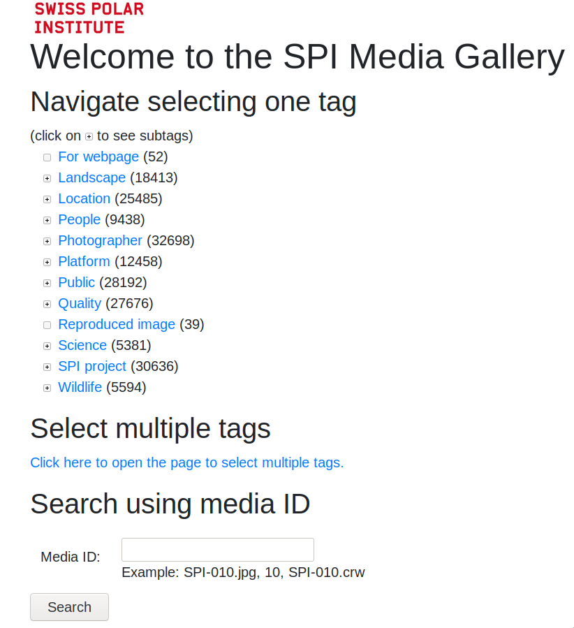
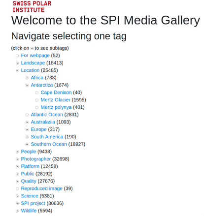
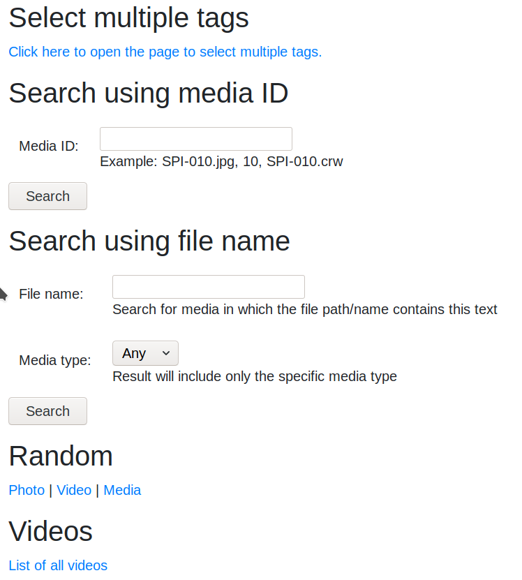
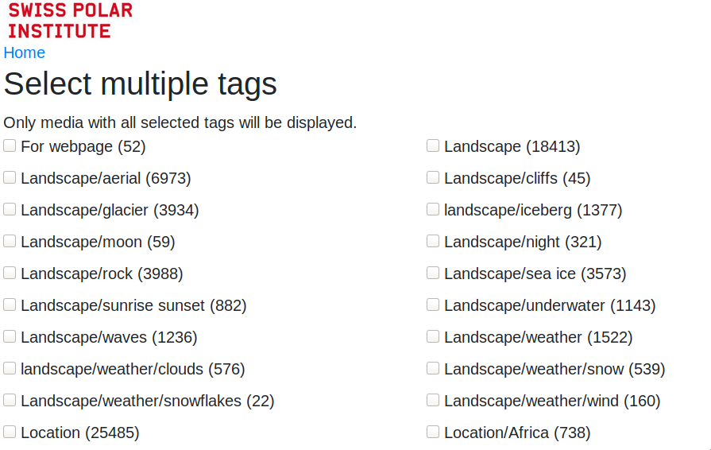
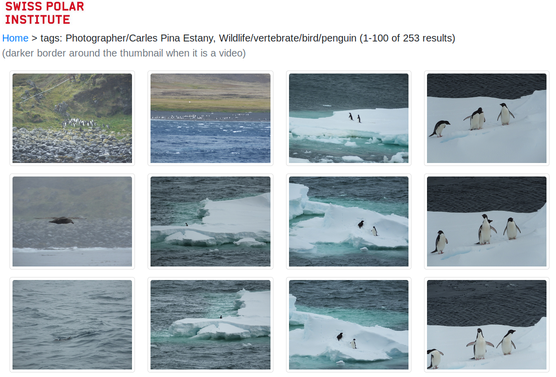
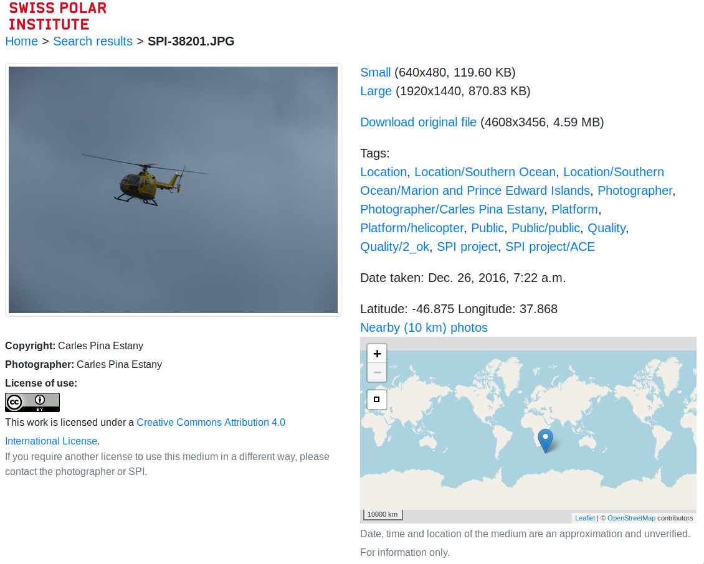

# spi-media-gallery

spi-media-gallery is a Django application developed for Swiss Polar Institute (SPI), currently used internally.

This is a Django application developed by the Swiss Polar Institute (SPI) and used internally since September 2019. The license is MIT: feel free to use it. If you need any help (there are no installation documentation at the moment) contact Carles Pina i Estany (https://github.com/cpina, carles.pinaestany@epfl.ch) or leave an issue.

project used internally by the Swiss Polar Institute

SPI has media stored in an object storage bucket (it's a in-house bucket but it could be an S3 bucket). It has more than 45000 photos (JPEG and different raw formats, about 0.5 TB) and more than 5000 videos (about 3.5 TB).

This tool was developed to be able to give easy access to these files. Different features of the tool:
 * It has support to create different sizes of the media in JPEG or webm (so any user with just a browser can access them)
 * It can import tags from Digikam XMP files into the database
 * It extracts the date+time of the photos, it can read a GPS track and geo-locate the photos (or manually)
 * Can search by tag or intersection of tags
 * Tags has a hierarchy
 * Can provide a list of all the videos or a CSV to make them easy to review
 * Can associate a photographer and a license to each photo
 * Django commands in order to associate photographers, copyright and licenses (based on the path of photos)
 * It has Django commands in order to rename tags or "merge" tags
 * It can export a directory as thumbnails and XMP files with the tags (not used much)
 
The tool could be used by other projects with similar needs (organise huge amount of photos). The advantage of this tool with other possible tools is that it's relatively easy to tune for specific needs. Ask if you doubt how to do something. The disavadvantage is obviously that it has been used only by one project and some features should be moved into the settings in order to personalise them better.

Currently, in order to add new media, it's needed to use Django commands: it's not possible to add media using or the web interface.

First part of the homepage:
<table><tr><td>

</td></tr></table
 
Tags with hierarchy:

<table><tr><td>

</td></tr></table

Second part of the homepage:

<table><tr><td>

</td></tr></table

Section to select multiple tags and see media with those tags:

<table><tr><td>

</td></tr></table

Photos intersection of two tags:

<table><tr><td>

</td></tr></table

Example of a photo:

<table><tr><td>

</td></tr></table

Please feel free to contact Carles Pina i Estany (https://github.com/cpina, github@pina.cat) for any help or in-depth information.
